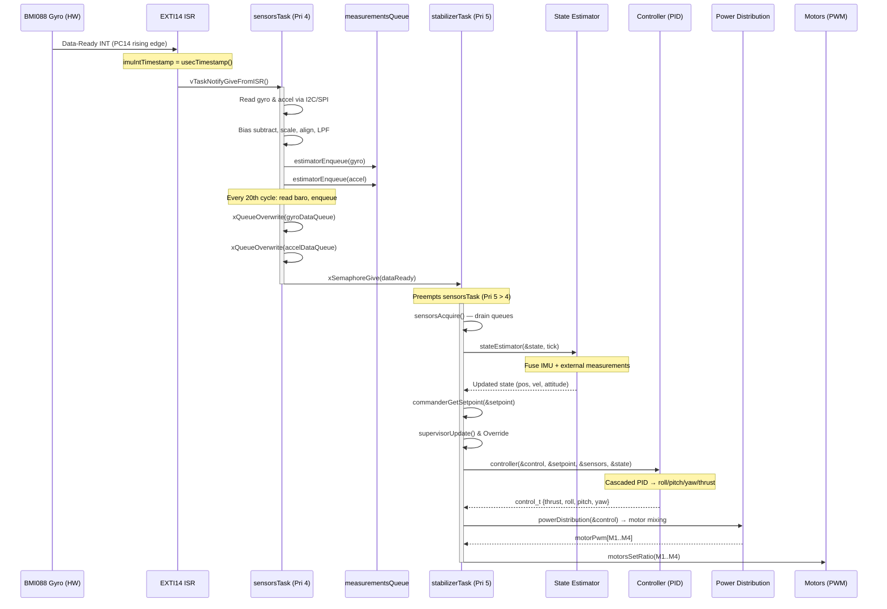
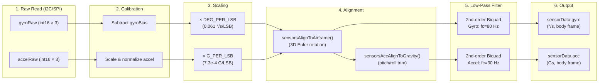
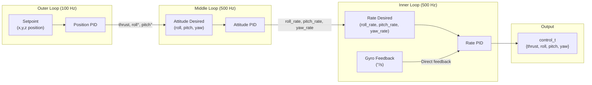
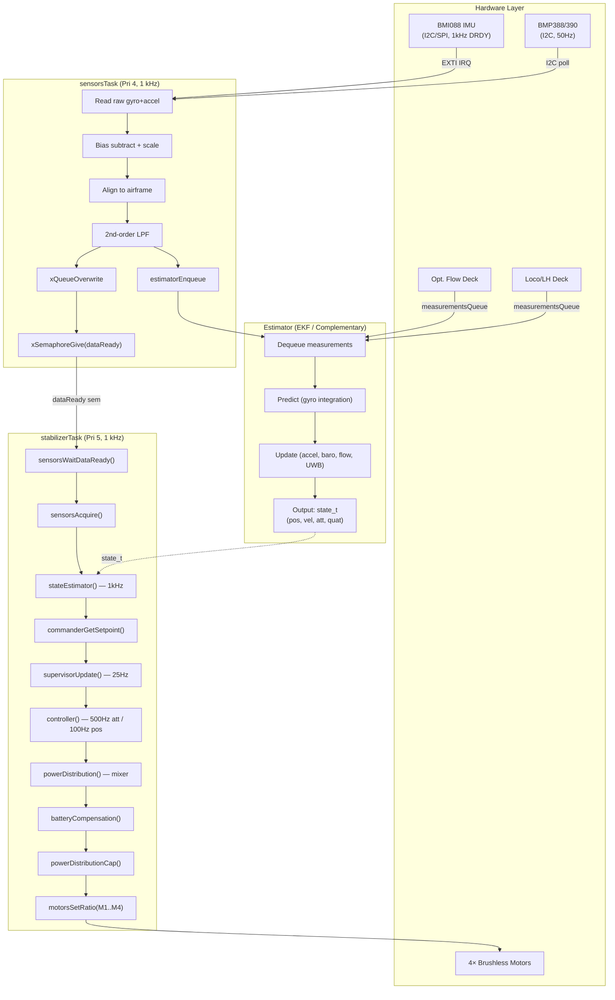

# Deep Dive: `stabilizerTask` & `sensorsTask`

## 1. The Big Picture — One Cycle at 1 kHz

The following sequence diagram shows exactly what happens in **every single 1 ms cycle** of the Crazyflie's flight controller:



---

## 2. `sensorsTask` — The Sensor Producer

> **Source:** [sensors_bmi088_bmp3xx.c](file:///d:/OneDrive_MSFT/Work/Drone_Research/research_docs/crazyflie-firmware/src/hal/src/sensors_bmi088_bmp3xx.c#L292-L377)

### 2.1 What It Does

The `sensorsTask` is the **data producer** of the flight control pipeline. It:

1. **Sleeps** until the IMU hardware fires a data-ready interrupt
2. **Reads** raw gyro and accelerometer data over I2C/SPI from the BMI088
3. **Processes** the raw data (calibration, bias subtraction, coordinate alignment, low-pass filtering)
4. **Publishes** the processed data through two parallel channels:
   - **`measurementsQueue`** → for the state estimator (Kalman filter)
   - **Single-element overwrite queues** (`gyroDataQueue`, `accelerometerDataQueue`) → for the stabilizer to read via `sensorsAcquire()`
5. **Signals** the `stabilizerTask` via the `dataReady` semaphore

### 2.2 Frequency

| Sensor | Hardware ODR | Software Read Rate | Mechanism |
|---|---|---|---|
| **BMI088 Gyroscope** | 1000 Hz | **1000 Hz** | Interrupt-driven (`EXTI14`) |
| **BMI088 Accelerometer** | 1600 Hz | **1000 Hz** (polled in sync with gyro) | Read alongside gyro each cycle |
| **BMP388/390 Barometer** | 50 Hz | **50 Hz** | Decimated: read every 20th cycle (`SENSORS_DELAY_BARO = 1000/50 = 20`) |
| **Magnetometer** | 20 Hz | **20 Hz** | Decimated: read every 50th cycle |

The master clock for the entire system is the **BMI088 gyroscope's 1 kHz data-ready interrupt**.

### 2.3 Interrupt → Task Wakeup Chain

```
BMI088 Gyro INT3 pin → STM32 PC14 → EXTI Line 14
    → EXTI15_10_IRQHandler()
        → EXTI14_Callback()
            → sensorsBmi088Bmp3xxDataAvailableCallback()
```

The callback ([line 994](file:///d:/OneDrive_MSFT/Work/Drone_Research/research_docs/crazyflie-firmware/src/hal/src/sensors_bmi088_bmp3xx.c#L994-L1004)):
```c
void sensorsBmi088Bmp3xxDataAvailableCallback(void) {
  portBASE_TYPE xHigherPriorityTaskWoken = pdFALSE;
  imuIntTimestamp = usecTimestamp();                         // Capture exact HW timestamp
  vTaskNotifyGiveFromISR(sensorsTaskHandle, &xHigherPriorityTaskWoken);  // Wake sensorsTask
  if (xHigherPriorityTaskWoken) { portYIELD(); }            // Context switch immediately
}
```

### 2.4 Signal Processing Pipeline

Every 1 ms, the raw sensor data goes through this pipeline:



**Key constants:**
- Gyro scale: $(2 \times 2000) / 65536 \approx 0.061\text{ °/s/LSB}$ (±2000 °/s range)
- Accel scale: $(2 \times 24) / 65536 \approx 7.3 \times 10^{-4}\text{ G/LSB}$ (±24G range)
- Gyro LPF cutoff: **80 Hz**
- Accel LPF cutoff: **30 Hz**

---

## 3. `stabilizerTask` — The Flight Controller

> **Source:** [stabilizer.c](file:///d:/OneDrive_MSFT/Work/Drone_Research/research_docs/crazyflie-firmware/src/modules/src/stabilizer.c#L289-L382)

### 3.1 What It Does

The `stabilizerTask` is the **real-time control loop**. Every 1 ms it:

1. **Blocks** on `sensorsWaitDataReady()` — waits for the `dataReady` semaphore from `sensorsTask`
2. **Acquires** the latest sensor data from the overwrite queues
3. **Estimates** the current state (position, velocity, attitude) using the selected estimator
4. **Gets** the desired setpoint from the commander
5. **Runs** the safety supervisor (can override setpoints or kill motors)
6. **Calculates** the control output (thrust, roll, pitch, yaw torques) via the selected controller
7. **Distributes** the control output to individual motor PWM signals
8. **Sends** PWM to the 4 motors

### 3.2 Sub-Rate Execution

Not every step runs at the full 1 kHz. The `RATE_DO_EXECUTE` macro ([line 375](file:///d:/OneDrive_MSFT/Work/Drone_Research/research_docs/crazyflie-firmware/src/modules/interface/stabilizer_types.h#L375)) decimates certain operations:

```c
#define RATE_DO_EXECUTE(RATE_HZ, TICK) ((TICK % (RATE_MAIN_LOOP / RATE_HZ)) == 0)
```

| Sub-System | Rate | Defined As |
|---|---|---|
| **Main stabilizer loop** | 1000 Hz | `RATE_MAIN_LOOP` |
| **Attitude controller (PID inner loop)** | 500 Hz | `ATTITUDE_RATE` |
| **Position controller (PID outer loop)** | 100 Hz | `POSITION_RATE` |
| **High-level commander** | 100 Hz | `RATE_HL_COMMANDER` |
| **Supervisor safety checks** | 25 Hz | `RATE_SUPERVISOR` |

### 3.3 The Main Loop (annotated)

```c
// stabilizer.c:315-381
while(1) {
    sensorsWaitDataReady();                    // BLOCK until sensorsTask gives dataReady
    sensorsAcquire(&sensorData);              // Drain latest data from overwrite queues

    // --- State Estimation ---
    stateEstimator(&state, stabilizerStep);    // Complementary filter or EKF

    // --- Safety Supervisor ---
    const bool areMotorsAllowedToRun = supervisorAreMotorsAllowedToRun();
    crtpCommanderBlock(!areMotorsAllowedToRun);  // Block incoming commands if unsafe

    // --- Setpoint Acquisition ---
    if (crtpCommanderHighLevelGetSetpoint(&tempSetpoint, &state, stabilizerStep)) {
        commanderSetSetpoint(&tempSetpoint, COMMANDER_PRIORITY_HIGHLEVEL);
    }
    commanderGetSetpoint(&setpoint, &state);

    // --- Supervisor Override ---
    supervisorUpdate(&sensorData, &setpoint, stabilizerStep);
    collisionAvoidanceUpdateSetpoint(&setpoint, &sensorData, &state, stabilizerStep);
    supervisorOverrideSetpoint(&setpoint);    // Can force thrust=0 if tumbling

    // --- Controller ---
    controller(&control, &setpoint, &sensorData, &state, stabilizerStep);

    // --- Motor Output ---
    if (areMotorsAllowedToRun) {
        controlMotors(&control);               // Power dist → battery comp → cap → PWM
    } else {
        motorsStop();                          // Force all motors to 0
    }

    xSemaphoreGive(xRateSupervisorSemaphore); // Signal rate supervisor
    stabilizerStep++;
}
```

---

## 4. Shared Resources & Protection

### 4.1 Complete IPC Map

| Resource | Type | Producer | Consumer | Protection |
|---|---|---|---|---|
| `dataReady` | Binary Semaphore (static) | `sensorsTask` | `stabilizerTask` | Signaling only; no data race |
| `gyroDataQueue` | 1-element Queue (static) | `sensorsTask` | `stabilizerTask` | `xQueueOverwrite` / `xQueueReceive` — FreeRTOS thread-safe |
| `accelerometerDataQueue` | 1-element Queue (static) | `sensorsTask` | `stabilizerTask` | Same as above |
| `barometerDataQueue` | 1-element Queue (static) | `sensorsTask` | `stabilizerTask` | Same as above |
| `measurementsQueue` | 20-element Queue (static) | `sensorsTask` + Deck tasks | State Estimator (EKF) | `xQueueSend` / `xQueueSendFromISR` — thread/ISR-safe |
| `canStartMutex` | Mutex (static) | `systemTask` | All tasks (`systemWaitStart()`) | Blocks all flight tasks until boot complete |
| `xRateSupervisorSemaphore` | Binary Semaphore | `stabilizerTask` | `rateSupervisorTask` | Rate monitoring; if not received in 2s → ASSERT |
| `imuIntTimestamp` | `volatile uint64_t` | EXTI ISR | `sensorsTask` | `volatile` ensures compiler doesn't optimize away; single-writer pattern |

### 4.2 Why It's Safe — Priority-Based Preemption

The key insight is that **the task priorities enforce a strict execution order**:

```
Priority 5 (HIGHEST) ─── stabilizerTask, rateSupervisorTask
Priority 4            ─── sensorsTask
Priority 3            ─── syslinkTask, usblinkTask, flowdeckTask, lighthouseTask
Priority 2            ─── systemTask, crtpTx/Rx, commanderHighLevel, kalmanTask
Priority 1            ─── logTask, paramTask, workerTask
Priority 0 (LOWEST)   ─── pmTask, proximityTask
```

> [!IMPORTANT]
> When `sensorsTask` (Pri 4) calls `xSemaphoreGive(dataReady)`, FreeRTOS immediately preempts it in favor of `stabilizerTask` (Pri 5), which is blocked on `xSemaphoreTake(dataReady)`. This guarantees **minimal and deterministic latency** (~μs) between sensor data becoming available and the control loop processing it.

### 4.3 Why Single-Element Queues with `xQueueOverwrite`?

The sensor queues are **1-element deep** and use `xQueueOverwrite()` instead of `xQueueSend()`:

```c
// sensors_bmi088_bmp3xx.c:109-116
static xQueueHandle accelerometerDataQueue;
STATIC_MEM_QUEUE_ALLOC(accelerometerDataQueue, 1, sizeof(Axis3f));  // Only 1 slot!
```

This is a **deliberate design choice**:
- `xQueueOverwrite` **never blocks** and always succeeds — it overwrites stale data
- The consumer (`stabilizerTask`) always gets the **freshest** sample, never stale data
- If the consumer is slow, old data is simply discarded — this is correct for a real-time control loop where freshness matters more than completeness

---

## 5. From Controller Output to Motor PWM

### 5.1 The Cascaded PID Controller

> **Source:** [controller_pid.c](file:///d:/OneDrive_MSFT/Work/Drone_Research/research_docs/crazyflie-firmware/src/modules/src/controller/controller_pid.c#L56-L163)

The default PID controller uses a **cascaded (two-loop) architecture**:



**At 100 Hz** — Position PID:
```c
positionController(&actuatorThrust, &attitudeDesired, setpoint, state);
```
Converts position/velocity errors → desired attitude angles (roll, pitch) and thrust.

**At 500 Hz** — Attitude PID:
```c
attitudeControllerCorrectAttitudePID(
    state->attitude.roll, state->attitude.pitch, state->attitude.yaw,
    attitudeDesired.roll, attitudeDesired.pitch, attitudeDesired.yaw,
    &rateDesired.roll, &rateDesired.pitch, &rateDesired.yaw);
```
Converts attitude errors → desired angular rates.

**At 500 Hz** — Rate PID:
```c
attitudeControllerCorrectRatePID(
    sensors->gyro.x, -sensors->gyro.y, sensors->gyro.z,  // Gyro feedback
    rateDesired.roll, rateDesired.pitch, rateDesired.yaw);

attitudeControllerGetActuatorOutput(&control->roll, &control->pitch, &control->yaw);
```
Converts angular rate errors → torque commands (roll, pitch, yaw numbers).

### 5.2 Power Distribution (Motor Mixing)

> **Source:** [power_distribution_quadrotor.c](file:///d:/OneDrive_MSFT/Work/Drone_Research/research_docs/crazyflie-firmware/src/modules/src/power_distribution_quadrotor.c#L84-L117)

The controller outputs `{thrust, roll, pitch, yaw}`. The **mixer** converts these into individual motor thrusts.

**Legacy mode** (simple integer mixing):
```c
// Motor layout (X configuration):
//    M1(CW)   M4(CCW)
//        \   /
//         \ /
//         / \
//        /   \
//    M2(CCW)  M3(CW)

r = control->roll / 2.0f;
p = control->pitch / 2.0f;

M1 = thrust - r + p + yaw;
M2 = thrust - r - p - yaw;
M3 = thrust + r - p + yaw;
M4 = thrust + r + p - yaw;
```

**Force/Torque mode** (SI-unit based, used by Mellinger/Lee controllers):
$$M_i = \frac{T}{4} \pm \frac{\tau_x}{4 \cdot l_{arm}} \pm \frac{\tau_y}{4 \cdot l_{arm}} \pm \frac{\tau_z}{4 \cdot k_\tau}$$

Where $l_{arm} = 0.707 \times \text{ARM\_LENGTH}$ (diagonal distance from center to motor).

### 5.3 Battery Compensation

> **Source:** [stabilizer.c](file:///d:/OneDrive_MSFT/Work/Drone_Research/research_docs/crazyflie-firmware/src/modules/src/stabilizer.c#L208-L219)

After mixing, the motor thrusts are compensated for battery voltage sag:

```c
static void batteryCompensation(...) {
    float b = 0.01f;  // Low-pass filter coefficient
    static float supplyVoltage = 4.2;
    supplyVoltage = supplyVoltage + b * (pmGetBatteryVoltage() - supplyVoltage);

    for (int motor = 0; motor < 4; motor++) {
        motorThrustBatCompUncapped->list[motor] =
            motorsCompensateBatteryVoltage(motor, thrust, supplyVoltage);
    }
}
```

This ensures that as the battery voltage drops from 4.2V to ~3.0V, the PWM duty cycle is increased proportionally to maintain consistent thrust.

### 5.4 Capping & Final PWM Output

> **Source:** [power_distribution_quadrotor.c](file:///d:/OneDrive_MSFT/Work/Drone_Research/research_docs/crazyflie-firmware/src/modules/src/power_distribution_quadrotor.c#L160-L190)

```c
bool powerDistributionCap(const motors_thrust_uncapped_t* uncapped, motors_thrust_pwm_t* motorPwm) {
    // Find the highest motor thrust
    int32_t highestThrustFound = 0;
    for (int i = 0; i < 4; i++) {
        if (uncapped->list[i] > highestThrustFound)
            highestThrustFound = uncapped->list[i];
    }

    // If any motor exceeds UINT16_MAX, reduce ALL motors equally
    int32_t reduction = 0;
    if (highestThrustFound > UINT16_MAX) {
        reduction = highestThrustFound - UINT16_MAX;
        isCapped = true;
    }

    for (int i = 0; i < 4; i++) {
        int32_t capped = uncapped->list[i] - reduction;
        motorPwm->list[i] = max(capped, idleThrust);  // Ensure minimum idle thrust
    }
}
```

> [!TIP]
> The capping strategy **preserves stability over thrust**: when one motor saturates, all motors are reduced equally, maintaining the roll/pitch/yaw torque ratios even if total thrust drops. This is a critical safety design.

The final PWM values (0–65535) are sent to the hardware:
```c
motorsSetRatio(MOTOR_M1, motorPwm->motors.m1);
motorsSetRatio(MOTOR_M2, motorPwm->motors.m2);
motorsSetRatio(MOTOR_M3, motorPwm->motors.m3);
motorsSetRatio(MOTOR_M4, motorPwm->motors.m4);
```

---

## 6. Complete Signal Flow Summary



## 7. Available Controller Types

The firmware supports **5 built-in controllers** selectable at runtime via the `stabilizer.controller` parameter:

| ID | Controller | Use Case |
|---|---|---|
| 1 | **PID** (default) | Standard cascaded PID. Simple, well-tuned for manual flight |
| 2 | **Mellinger** | Geometric tracking controller (force/torque). Aggressive acrobatics |
| 3 | **INDI** | Incremental Nonlinear Dynamic Inversion. Robust to model uncertainty |
| 4 | **Brescianini** | Nonlinear attitude controller |
| 5 | **Lee** | SE(3) geometric controller. Precise trajectory tracking |

All controllers share the same interface ([controller.c](file:///d:/OneDrive_MSFT/Work/Drone_Research/research_docs/crazyflie-firmware/src/modules/src/controller/controller.c)):
```c
void controller(control_t *control, const setpoint_t *setpoint,
                const sensorData_t *sensors, const state_t *state,
                const stabilizerStep_t stabilizerStep) {
    controllerFunctions[currentController].update(control, setpoint, sensors, state, stabilizerStep);
}
```

This **function pointer table pattern** makes it trivial to swap controllers at runtime without recompiling.
